# Comp 3015 CW2 Optimised Developer tool 
# By Harry Watton 

# Versioning information 
The code was tested with the following specifications  
Operating system: windows 11 
Visual studio version: Visual studio 2022 

# How does it work?
To put it simply, my shader program runs by generating edge quads using a geometry shader, then in the fragment shader, PBR and toon shading is applied. In addition there is the option to toggle between flat colours and full textures, displaying edge lines, and disintegration effects to add a weathered look to the objects as well as texture mixing.

## Pipeline 
This section details the shader pipeline and the process it follows to provide shading 
### Vertex shader 
The vertex shader is the first step of the shader pipeline and it lays the essential ground work for the rest of the shaders.  The key functionality done here is that it converts the vertex positions of the object mesh into a format usable by the GPU, without it the rendering would not be able to occur. The transformation is completed using the model view projection by using the model view position data and then using projection to make the object appear smaller/bigger depending on how close or distant from the camera the object is   
The following stages rely on the vertex shader as the position and Normal data transformed and set up here are used in the geometry shader for detecting whether something is an edge for silhouette lines and used in fragment shader for lighting calculations.
### geometry shader 
The next step in the shader pipeline was the geometry shader  
Using the MVP matrix seen in vertex shader, whole triangles potentially see transformations. In most cases the vertices do not see transformations, but in some cases a triangle may be determined to be an edge, in which case extra geometry is generated to act as the edge which is also flagged to determine it is an edge. This is then passed to the fragment shader. In addition.    
The process of this is included to allow for silhouette lines to be included, for more details please see the relevant section below. positional data for the nosie texture is passed here  
### Fragment shader 
The final step is the fragment shader, where all the data set up previously can finally be turned into the output colour of the shader  
The first step fragment shader takes is to check if the geometry it is providing colour for is an edge. If it is then the shader will simply return the colour black. Creating the effect of a black outline on any models this is added for, this can be toggled on and off   
Following this, a check will be done using a noise texture, if the value of the texture is within a certain freshold, that vertex is discarded which creates a disintegration effect. This can be toggled on and off so some models can have a damaged look while others can remain looking normal. More details on this can be seen in the section below for individual techniques  
Otherwise, the geometry will have PBR applied and then get overlayed by a toon shading method to create the final colour which is then returned and displayed on the object. This can be swapped between using a flat colour or texture sampling for more options when setting up the scene. In additon texture mixing can be toggled on and off for even more options 
For more details on the toon shading, silhouette lines and PBR please see the section below detailing the individual techniques 

## Individual techniques 
This section details the individual techniques that come together to make up the shaders
## Physics based rendering (PBR)
PBR was used as the base of the project,and was one of the main shading features.
It was chosen over other lighting models (e.g Blinn Phong) due to the extra detail and accuracy it allows   
In my code, PBR exists as part of the fragment shader, where normals and position data is already set up by the vertex shader. The first step the PBR code takes is normalising the Normal value followed by applying the microfacet model.    
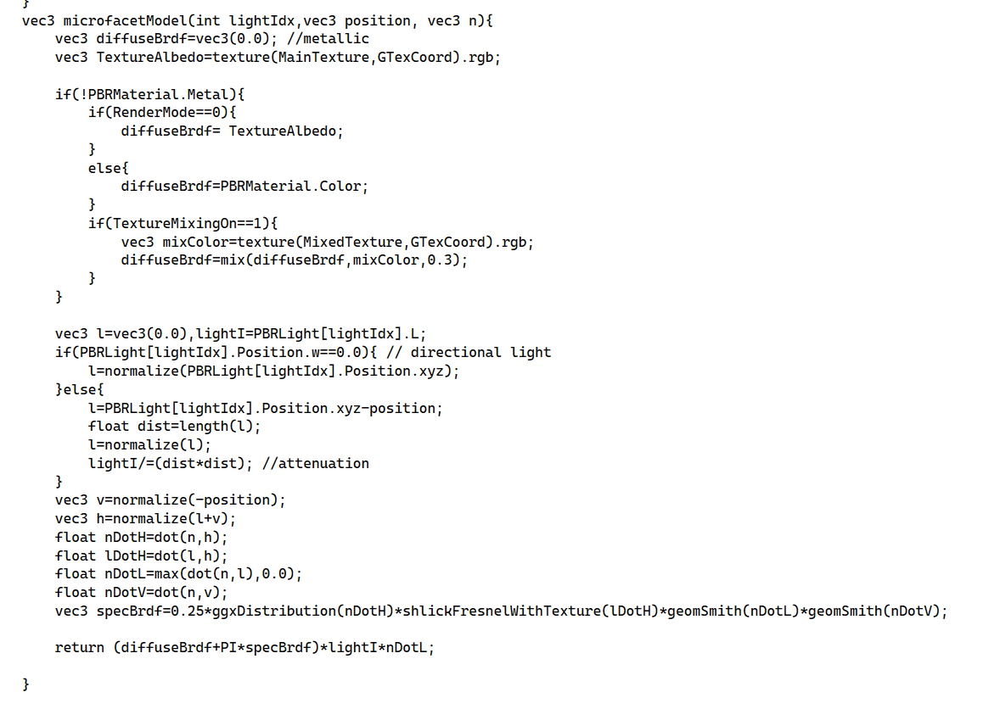
In the process of applying the micro facet model, the first step is checking if the material is a metal which is done using the value in the material struct. If it is not a metal, the diffuse colour is set to the colour defined in the struct. This is important as it ensure Dielectrics do not end up too shiny.The next step is determining the lights direction where the the intensity of the light is increased based on the distance from the light, this is what is known as attenuation and it is important as otherwise the mesh would be equally bright regardless of its position in relation to the light. The next step sees the position vector and halfway vectors normalised to ensure correct calculations. This is then followed by a set of dot product calculations which are then used to calculate the specular value. This is a set of values multiplied together to make up the final value which makes use of ggxDistribution (controls how rough the surface looks by adding some variance to highlights), shlickFresnel(determines how reflective the material is relative to the angle of the light) and geomsmith (controls what part of the mesh is blocked) calculations   
The microfacet model was applied multiple times,once for every light. The value of each application was totalled up and then used for gamma correction. This was the final step needed before it could be mixed with toon shading and then returned as the frag colour   
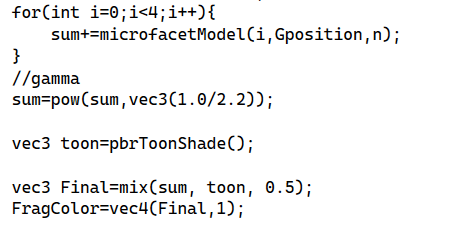   
In addition, multiple different options were included for the colour for drawing the model. The scene can swap between drawing with a texture or a flat colour with a simple setting of a uniform. This means that models with a full texture for them (e.g the butterfly) can be drawn with that, but if a model does not have a texture (e.g the sword), then the model can still be drawn in a colour that looks correct. In addition to this texture mixing is included as an option, this is toggleable for differant purposes. For example the sword has no texture mixing, but the trees use it as a way to make it look like there are leaves and greenery.

Please note, the code from lab 10 was used as a base and adapted for this project  
Please also note, texture mixing was taken from my CW1 and adapted to be toggleable.  
## Silhouette lines and toon shading
Another key technique used was silhouette lines with toon shading. This was used to give a cartoon look which makes the shading a lot more stylised and unique, and it created an interesting contrast by being combined with the more realistic element of the physic based rendering.   
 
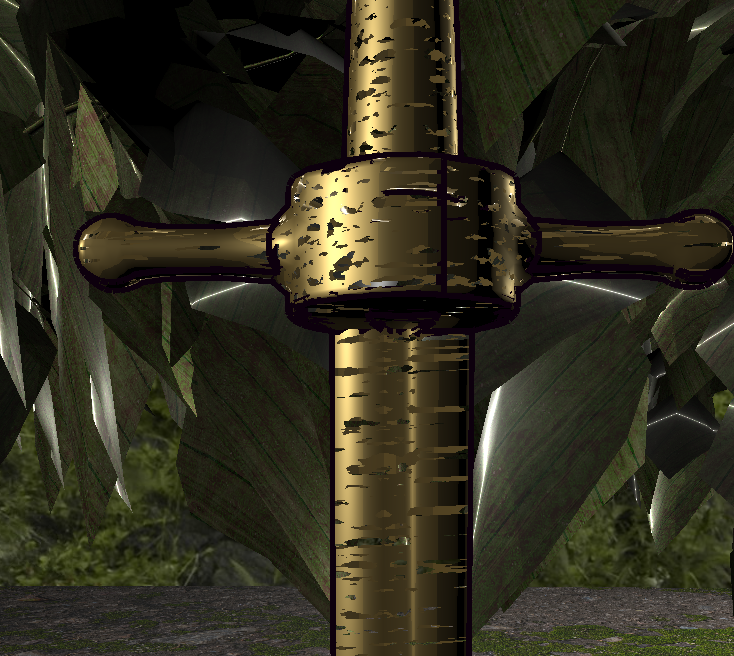 
The inclusion of this technique prompted the inclusion of the geometry shader as well as the need for each mesh to be loaded with adjacency to allow for the desired geometry shading(done using the built-in function in objmesh.cpp). In the geometry shader, a set of vertices (e.g a triangle) is looked at. When looking at it, it will determine if the vertices are an edge of a mesh and if it is then it is marked as an edge and extra geometry is added to be used as the silhouette line later. These faces are then passed to the fragment shader. Before being passed, a flag is set to determine if the vertices are an edge   
In the fragment shader the edge flag is checked. If it is indeed an edge, the fragment shader will return flat black as the colour. meaning edges are shaded with a clear differentiation from the more regular shaded sections   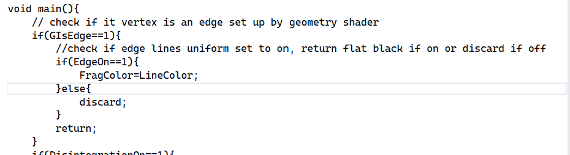   

If it is not an edge, then the PBR code is run through (details of this can be seen in the section above), but once that is complete, a toon based shader adapted to work with PBR is run. This runs through similar steps as the PBR code but has a toon overlay, where instead of a smooth  light transition, shadows/light levels change more suddenly, this leads to more simple shading like what is seen in cartoons. 
This is then mixed with the PBR calculation seen earlier to create the mixed look the shader aims for . In addition, the mixing can be controlled with one shading technique given bias to have more of a focus compared to the other if it makes sense, this is controlled by the value in the line where the 2 are mixed with 0.5 being balanced and increasing or decreasing the value (it must stay between 0 and 1) increasing the prevalence of one of the techniques.   
The edge lines can be controlled and adjusted with 2 variables. PctExtend increases the length of the silhouette, allowing for control of how silhouettes overlap. Edgewidth determines how wide the edges actually are, allowing for control over how thick/thin the lines should be and also giving the option between more bold lines or more subtle lines depending on the situation. 
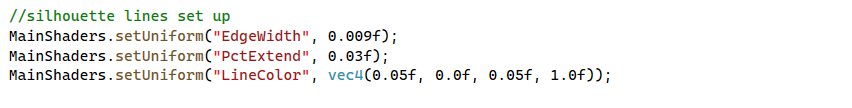 

Please note,the code for this technique was an adapted version of the code seen in lab 6 part 3, the geometry shader is almost identical but passes some extra positional data.

## Noise and disintegration effect
 
To add the effect of the sword being damaged with chunks missing, a disintegration effect was used. To ensure other models were not affected this could be toggled on and off by setting a uniform.  
The way this worked was that in the C++, a noise texture would be generated and then passed into the shader. This was done using the nosie helper class from the lab sessions. In addition a slice model was set up to determine how noise would be sampled. Finnally the threshold for noise detection was declared and sent to the shader  
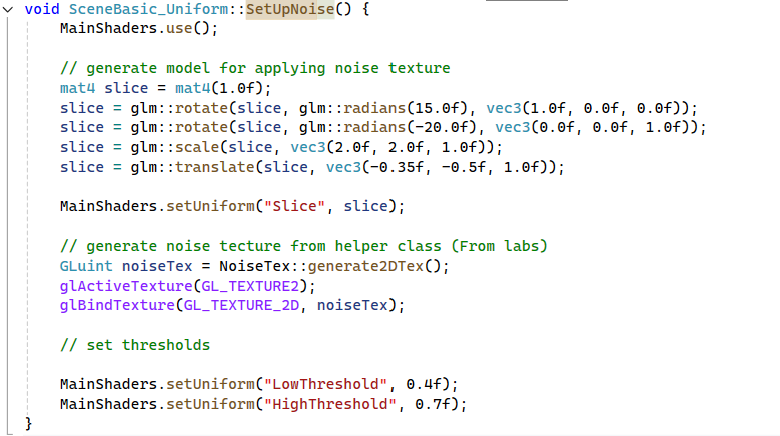 

In the shaders, the geometery shader will pass the position data for the noise texture to the fragement shader. In the fragment shader, the noise texture is then sampled in relation to the slice texture set up earlier. When sampling this texture, if the noise value sampled is between the threshold declared earlier then that fragment is discarded creating the effect of damage/chipping to the sword  
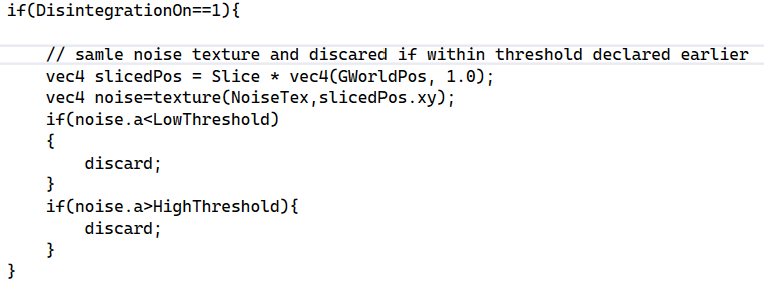 

  

Please note, the code for this was taken from the lab 9 excercise 3 code and adapted for use wih the other shader
## Multiple shaders 
In addition to the main shaders, there was also 2 other shader programs implemented. The First of these is the ground shaders which are used to draw the ground. These are essentially the same as the main shaders but stripped back to have no geometry shader. This is to allow the plane used for the ground to be drawn as the main shaders were incompatible due to the need for adjacency, which the plane could not be loaded with. In addition there were the skybox shaders, which essentially just apply the texture to the skybox.

# What makes your shader program special and how does it compare to similar things? 
My shader program is special in the way it combines PBR and cell shading/silhouette lines. These 2 techniques are not typically seen together. Where PBR is used for realistic looking shaders and toon shading is designed for less realistic cartoonish looks they dont ussually have a reason to interact. So my shaders are special in the way that it has a mix of cartoon style and realistic style in a way you normally would not see. Most existing shaders will lean into one or the other making my shader stand out.

# Anything else which will help us to understand how your prototype works 
## Gameplay description 
Some very basic gameplay was added to help the scene come alive. In this gameplay, there is a set of 5 butterflies moving around the scene. When the player collides with a butterfly, that butterfly is counted as collected and will disappear. When all 5 are collected, the game will be seen as completed, and as a result of the game being completed the sword will rise from the stone and begin to glow, the disintegration effect will also be turned off to allow for the sword to look as if it repaired itself. It is very simple gameplay but it acts as a method of giving the player a task to complete while showing off the shaders.  
Sword before collecting all butterflies 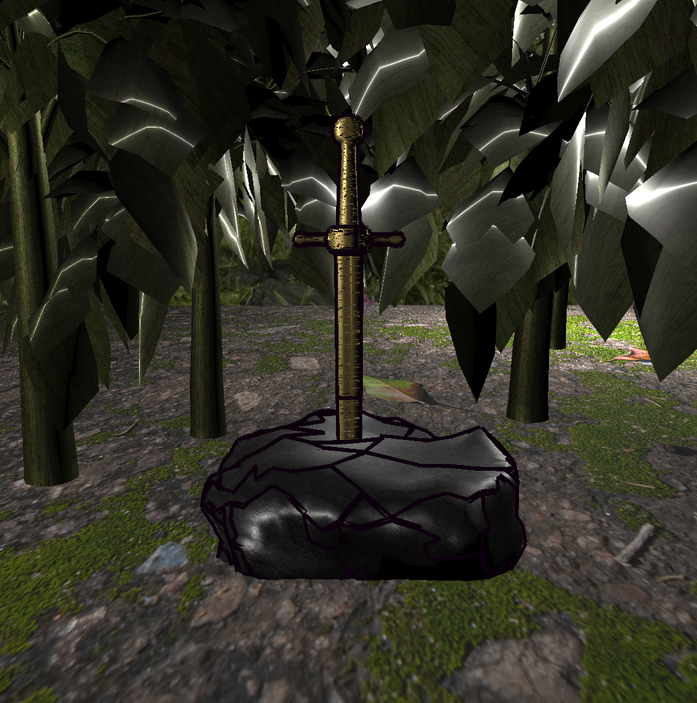  
Sword after collecting all butterflies 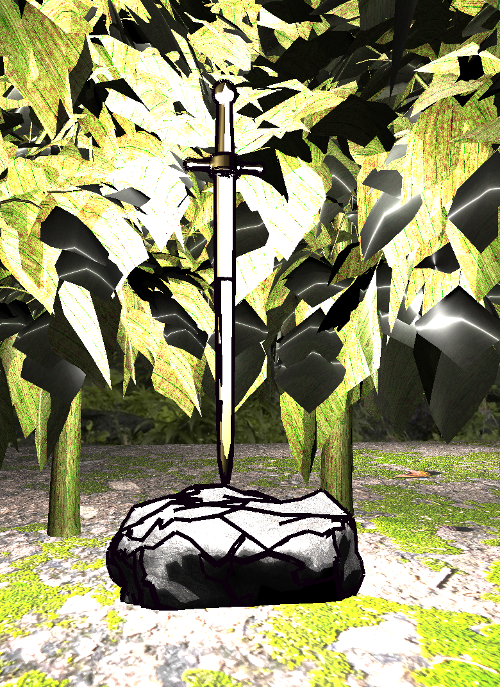  

## Code origins
The code used in the program was taken mostly from lab sessions and then combined and adjusted to fit the purposes of this project. 
The starting point of the code was to use the PBR from lab session 10 and test out how the metallics looked on the sword model. After particularly liking how this looked,I decided to use this as my base. Originally the plan was to build off my scene from CW1 but after seeing this I decided to completely remake it and where necessary pull things over. 
With this code base created, the next steps were implementing the silhouette lines and and toon shading code from lab session 8,prompting the use of the geometry shader.  This ultimately caused the creation of a second set of shaders, as the plane used for the ground of the scene was not compatible with the adjacency triangles required. These shaders are essentially the same, just without the addition of silhouette lines. Finally the disintegration effect from lab session 9 was implemented to allow for a damaged look on the sword. This required some adjustment to the geometry shader to pass more values.  
As previously mentioned, aspects of my submission for CW1 were re implemented in some ways. For example the same tree model was used and the code for moving butterflies was partially reused but adapted to support an array of butterfly position values

## Asset usage 
A variety of assets were used in the development of this project. These are detailed below as well as their source. 
### Models
Sword model: https://free3d.com/3d-model/medieval-sword-69788.html  
Rock model and texture (reused from 3016 cw2): https://www.turbosquid.com/3d-models/rock07base3ds-3d-1899446  
Tree model (reused from 3016 cw2): https://www.turbosquid.com/3d-models/gentree-103-generic-tree-103-3d-model-2062798  
Butterfly model and texture (reused from 3016 cw2): https://www.turbosquid.com/3d-models/butterfly-fly-3d-obj/460590
### Textures
Skybox (reused from 3015 cw1): https://opengameart.org/content/forest-skyboxes  
moss/leaves: Source code from labs  
Ground: https://www.magnific.com/free-photo/photo-ground-texture-pattern_198163212.htm#fromView=keyword&page=1&position=4&uuid=bea7c744-c5d3-4edb-8539-c106a228312c&query=Forest+ground+texture+cartoon      
Bark: https://www.magnific.com/free-vector/dark-wood-texture_1036321.htm#fromView=keyword&page=1&position=20&uuid=40d5d19b-9995-44c6-bb17-8d353f1b190d&query=Bark+texture   

 # Use of AI statement
 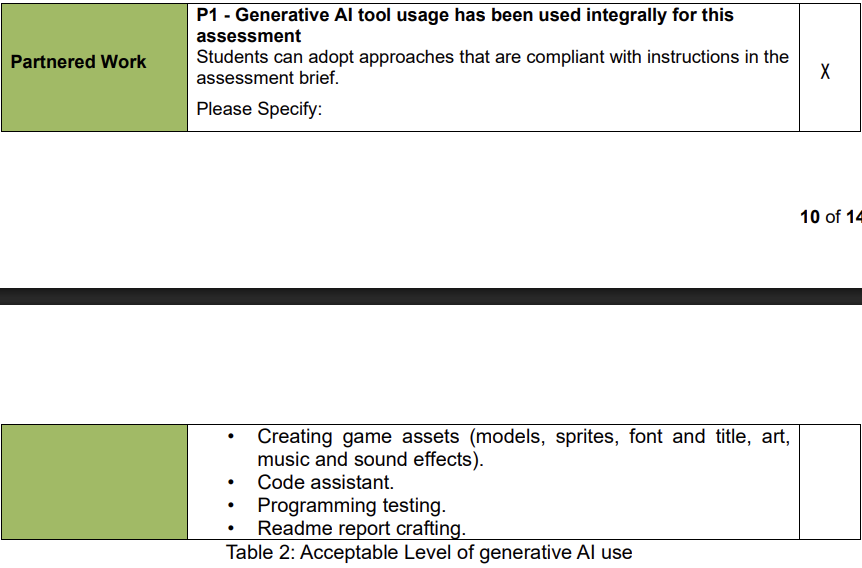
 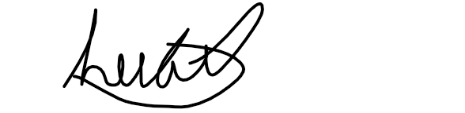
 AI was used throughout this project as a coding assistant (as specified as allowed in the coursework specifications). There were a variety of areas where this was used as detailed below  
 ## Code assistant 
One key area this was used was in assisting with setting up different shading features. An example of this was when setting up the disintegration, there was some issues with getting it to work with the existence of geometry shader, so following AIs advice I was able to set up and pass values as needed to be used for this purpose.   
Another example of how this was used was when setting up the PBR to work with the toon shading. Initially I had a much more simple toon shade set up that didnt interact as much with the PBR code, it was a lot closer to how it appears in the lab version of the code. However this didnt give the desired PBR look the project was initally built around. So in this case the AI suggested and assisted in implementing the pbr toon shade function and the idea of mixing regular pbr and the toon shade pbr for the final result  
## debugging
It was also used as a key assistant in debugging various issues throughout the program. A key example of this was when I was attempting to setup the silhouette lines and I was not fully understanding what the load with adjacency really meant. When I first tried passing the mesh that were loaded regularly to the shaders it caused an error, and I believed at the time this was to do with the mesh themselves (When looking over my code from the lab I missed the use of the way the mesh was loaded and instead saw triangulated in the mesh name and thought that meant only very specific models were suitable for this). With AIs help I was able to realise the lab code for the load with adjacencies function solved this problem, something that I initially missed. Initially AI also suggested ways to implement my own code to build adjacencies but this method was not used in the end. From this I also went on to make the seperate ground shaders due to the lack of ability to load plane in this way.

## Features used in CW1 
Some features of my code were reused/reimplemented from CW1, one of these features was the camera movement. While this was not a new addition for this coursework it is still important to note that as, stated in that use of AI statement, AI was used in the set up of this in an assistive role. The follow is an extract from that declearation:  "For example, when programming the camera movement, I was unsure initially how to edit the position and use GLFW functionality as the GLFW window was in scene runner and thus inaccessible to the code in scene basic uniform where I wanted to place the code. The AI suggested the solution (mentioned in the how does it work section) which I was then able to implement "

# Github repository link
https://github.com/harry-jw-plymouth/3015-CW2.git  

# A link to the unlisted YouTube Video

